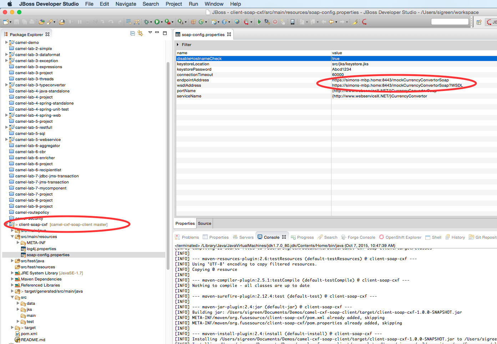
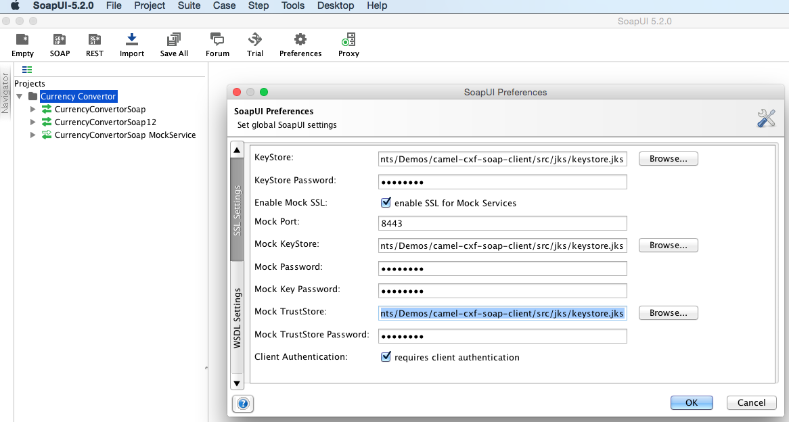
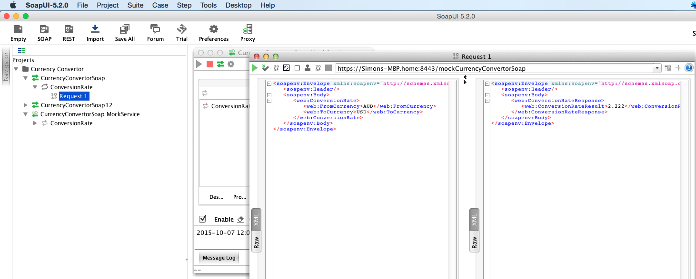

# Camel-CXF SOAP Client Demonstration (with 2-way SSL)

This repository contains an example Camel-cxf project demonstrating client SOAP request/reply with 2-way SSL (client authentication).

### Getting Started

To get started, clone this repository to your local machine and use your favorite tools to dig in deeper.

### Prerequisites
You'll need the following software to complete this POC:

* [Maven 3.2.x](http://archive.apache.org/dist/maven/maven-3/3.2.5/)
* [Git](https://git-scm.com/downloads)
* [JBoss Developer Studio](http://www.jboss.org/products/devstudio/download/)
* [SoapUI](http://www.soapui.org/downloads/soapui/open-source.html) 

### Command line
Navigate to directory where you want to clone this project:
    
    cd $proj_root
    git clone git@github.com:sigreen/camel-cxf-soap-client.git
    cd camel-cxf-soap-client
    
Now run maven to build the project:

    mvn clean install 
    
Things should compile, the tests should run (successfully!) and you should end up with a terminal like this:

```
[INFO] Scanning for projects...
[INFO]                                                                         
[INFO] ------------------------------------------------------------------------
[INFO] Building A Camel Spring Route 1.0.0-SNAPSHOT
[INFO] ------------------------------------------------------------------------
[INFO] 
[INFO] --- maven-clean-plugin:2.5:clean (default-clean) @ client-soap-cxf ---
[INFO] Deleting /Users/sigreen/Documents/Demos/camel-cxf-soap-client/target
[INFO] 
[INFO] --- cxf-codegen-plugin:3.1.3:wsdl2java (generate-sources) @ client-soap-cxf ---
[INFO] 
[INFO] --- maven-resources-plugin:2.6:resources (default-resources) @ client-soap-cxf ---
[INFO] Using 'UTF-8' encoding to copy filtered resources.
[INFO] Copying 5 resources
[INFO] 
[INFO] --- maven-compiler-plugin:2.5.1:compile (default-compile) @ client-soap-cxf ---
[INFO] Compiling 11 source files to /Users/sigreen/Documents/Demos/camel-cxf-soap-client/target/classes
[INFO] 
[INFO] --- maven-resources-plugin:2.6:testResources (default-testResources) @ client-soap-cxf ---
[INFO] Using 'UTF-8' encoding to copy filtered resources.
[INFO] Copying 0 resource
[INFO] 
[INFO] --- maven-compiler-plugin:2.5.1:testCompile (default-testCompile) @ client-soap-cxf ---
[INFO] Nothing to compile - all classes are up to date
[INFO] 
[INFO] --- maven-surefire-plugin:2.12.4:test (default-test) @ client-soap-cxf ---
[INFO] 
[INFO] --- maven-jar-plugin:2.4:jar (default-jar) @ client-soap-cxf ---
[INFO] Building jar: /Users/sigreen/Documents/Demos/camel-cxf-soap-client/target/client-soap-cxf-1.0.0-SNAPSHOT.jar
[INFO] 
[INFO] --- maven-install-plugin:2.4:install (default-install) @ client-soap-cxf ---
[INFO] Installing /Users/sigreen/Documents/Demos/camel-cxf-soap-client/target/client-soap-cxf-1.0.0-SNAPSHOT.jar to /Users/sigreen/.m2/repository/org/fusesource/client-soap-cxf/1.0.0-SNAPSHOT/client-soap-cxf-1.0.0-SNAPSHOT.jar
[INFO] Installing /Users/sigreen/Documents/Demos/camel-cxf-soap-client/pom.xml to /Users/sigreen/.m2/repository/org/fusesource/client-soap-cxf/1.0.0-SNAPSHOT/client-soap-cxf-1.0.0-SNAPSHOT.pom
[INFO] ------------------------------------------------------------------------
[INFO] BUILD SUCCESS
[INFO] ------------------------------------------------------------------------
[INFO] Total time: 3.429 s
[INFO] Finished at: 2015-10-07T12:19:09-04:00
[INFO] Final Memory: 31M/299M
[INFO] ------------------------------------------------------------------------
```

### Using JBDS
To checkout and build with JBDS, go to `File-->Import` and choose the `Existing maven project from SCM` option. In the first dialog, enter the project git URL `https://github.com/sigreen/camel-cxf-soap-client` and click `Finish` JBDS should then proceed to clone and build the source code.

## Explore the project

We now have the project checked so let's explore it. Here is the project that was imported into the IDE:

* `client-soap-cxf` -- this is the top-level parent project

If we navigate to the `client-soap-cxf` project and open the `src/main/resources/META-INF/spring/camel-context.xml` file we should see the Fuse tooling display the route(s) using a visual notation. (Note, if you don't see the visual camel diagrams, make sure to install the Integration Stack as [described on the JBDS getting started page](http://www.jboss.org/products/devstudio/get-started/#!project=devstudio). 

## Update the properties

Update the configuration properties to match your local development environment:

 

### Configuring SoapUI Mock Service (SOAP Server)

Open SoapUI and import the project located at src/test/soapui/CurrencyCOnverterMockServer.xml.  Start by configuring the SSL preferences like so:

 
 
After you've updated the SSL settings and saved the preferences, start the mock service (acting as a SOAP server with 2-way SSL enabled).  If you have configured and started the mock service correctly, you should be able to send yourself
a test message using the request tool like so:

 

#### SSL Configuration in Camel / CXF

In the camel-context.xml, we configure SSL using tlcClientParameters.  The key pieces here are "disableCNCheck" - this eliminates hostname verification that is annoying when using localhost in development.  Also notice that I have co-located
both my truststore and keystore in one JKS file to simplify things.

```
	<http:conduit name="*.http-conduit">
		<http:tlsClientParameters disableCNCheck="${disableHostnameCheck}">
			<sec:keyManagers keyPassword="${keystorePassword}">
				<sec:keyStore type="JKS" password="${keystorePassword}"
					file="${keystoreLocation}" />
			</sec:keyManagers>
			<sec:trustManagers>
				<sec:keyStore type="JKS" password="${keystorePassword}"
					file="${keystoreLocation}" />
			</sec:trustManagers>
			<sec:cipherSuitesFilter>
				<!-- these filters ensure that a ciphersuite with export-suitable or 
					null encryption is used, but exclude anonymous Diffie-Hellman key change 
					as this is vulnerable to man-in-the-middle attacks -->
				<sec:include>.*_EXPORT_.*</sec:include>
				<sec:include>.*_EXPORT1024_.*</sec:include>
				<sec:include>.*_WITH_DES_.*</sec:include>
				<sec:include>.*_WITH_AES_.*</sec:include>
				<sec:include>.*_WITH_NULL_.*</sec:include>
				<sec:exclude>.*_DH_anon_.*</sec:exclude>
			</sec:cipherSuitesFilter>
		</http:tlsClientParameters>
		<http:client AutoRedirect="true" Connection="Keep-Alive"
			ReceiveTimeout="${connectionTimeout}" ConnectionTimeout="${connectionTimeout}"  />
	</http:conduit>      
```     

#### WSDL First Approach

For this example I used a sample WSDL from SoapUI and imported it into my Maven project. The key here is to include the cxf-codegen-plugin in your 
POM file that builds the associated JAVA objects to call our sample SOAP service (hosted by SoapUI).

```
			<plugin>
				<groupId>org.apache.cxf</groupId>
				<artifactId>cxf-codegen-plugin</artifactId>
				<version>3.1.3</version>
				<executions>
					<execution>
						<id>generate-sources</id>
						<phase>generate-sources</phase>
						<goals>
							<goal>wsdl2java</goal>
						</goals>
						<configuration>
						<sourceRoot>${basedir}/target/generated/src/main/java</sourceRoot>
							<wsdlOptions>
								<wsdlOption>
									<wsdl>${basedir}/src/main/resources/META-INF/wsdl/currencyConvertor.wsdl</wsdl>
								</wsdlOption>
							</wsdlOptions>
						</configuration>
					</execution>
				</executions>
			</plugin>
```

#### How to create the SOAP request body

For creating a sample SOAP request body, I've created a utility bean that creates the SOAP body for me.  Here is the code:

```java
package org.fusesource.client.soap.cxf;

import org.apache.camel.Exchange;
import org.apache.camel.Header;

import net.webservicex.ConversionRate;
import net.webservicex.Currency;

public class CreateSoapRequest {
	
	public void createSoapBody(@Header("fromCurrency") String fromCurrency, @Header("toCurrency") String toCurrency, Exchange exchange) {
		ConversionRate request = new ConversionRate();
		request.setToCurrency(Currency.valueOf(toCurrency));
		request.setFromCurrency(Currency.valueOf(fromCurrency));
		exchange.getIn().setBody(request);
	}

}
```

To call our sample webservice, I simply set 2 header values (toCurrency and fromCurrency) then call my sample bean to create the SOAP request.

```
	<camelContext xmlns="http://camel.apache.org/schema/spring">

		  <dataFormats>
            <soapjaxb contextPath="net.webservicex" id="soapFormat"/>
		  </dataFormats>

		<route>
			<from uri="timer://foo?repeatCount=1"/>
			<setHeader headerName="fromCurrency">
				<constant>USD</constant>
			</setHeader>
			<setHeader headerName="toCurrency">
				<constant>AUD</constant>
			</setHeader>
			<bean ref="soapRequestPojo" method="createSoapBody"/>
			<marshal ref="soapFormat"/>
			<to uri="cxf:bean:cxfClientEndpoint?dataFormat=MESSAGE&amp;headerFilterStrategy=#cxfHeaderFilterStrategy" />
		</route>
	</camelContext>
```

### Running routes stand-alone (outside of fuse)

Right click the `camel-context.xml` go to `RunAs-->Local Camel Context (without tests)` 

We should see the console spit out some messages like this (which let us know everything is running correctly and bound to the correct ports):

```
[INFO] Scanning for projects...
[INFO] 
[INFO] Using the builder org.apache.maven.lifecycle.internal.builder.singlethreaded.SingleThreadedBuilder with a thread count of 1
[INFO]                                                                         
[INFO] ------------------------------------------------------------------------
[INFO] Building A Camel Spring Route 1.0.0-SNAPSHOT
[INFO] ------------------------------------------------------------------------
[INFO] 
[INFO] --- maven-clean-plugin:2.5:clean (default-clean) @ client-soap-cxf ---
[INFO] Deleting /Users/sigreen/Documents/Demos/camel-cxf-soap-client/target
[INFO] 
[INFO] --- cxf-codegen-plugin:3.1.3:wsdl2java (generate-sources) @ client-soap-cxf ---
[INFO] 
[INFO] --- maven-resources-plugin:2.6:resources (default-resources) @ client-soap-cxf ---
[INFO] Using 'UTF-8' encoding to copy filtered resources.
[INFO] Copying 5 resources
[INFO] 
[INFO] --- maven-compiler-plugin:2.5.1:compile (default-compile) @ client-soap-cxf ---
[INFO] Compiling 11 source files to /Users/sigreen/Documents/Demos/camel-cxf-soap-client/target/classes
[INFO] 
[INFO] --- maven-resources-plugin:2.6:testResources (default-testResources) @ client-soap-cxf ---
[INFO] Not copying test resources
[INFO] 
[INFO] --- maven-compiler-plugin:2.5.1:testCompile (default-testCompile) @ client-soap-cxf ---
[INFO] Not compiling test sources
[INFO] 
[INFO] --- maven-surefire-plugin:2.12.4:test (default-test) @ client-soap-cxf ---
[INFO] Tests are skipped.
[INFO] 
[INFO] --- maven-jar-plugin:2.4:jar (default-jar) @ client-soap-cxf ---
[INFO] Building jar: /Users/sigreen/Documents/Demos/camel-cxf-soap-client/target/client-soap-cxf-1.0.0-SNAPSHOT.jar
[INFO] 
[INFO] >>> camel-maven-plugin:2.15.1.redhat-620133:run (default-cli) @ client-soap-cxf >>>
[INFO] 
[INFO] --- cxf-codegen-plugin:3.1.3:wsdl2java (generate-sources) @ client-soap-cxf ---
[INFO] 
[INFO] --- maven-resources-plugin:2.6:resources (default-resources) @ client-soap-cxf ---
[INFO] Using 'UTF-8' encoding to copy filtered resources.
[INFO] Copying 5 resources
[INFO] 
[INFO] --- maven-compiler-plugin:2.5.1:compile (default-compile) @ client-soap-cxf ---
[INFO] Nothing to compile - all classes are up to date
[INFO] 
[INFO] --- maven-resources-plugin:2.6:testResources (default-testResources) @ client-soap-cxf ---
[INFO] Not copying test resources
[INFO] 
[INFO] --- maven-compiler-plugin:2.5.1:testCompile (default-testCompile) @ client-soap-cxf ---
[INFO] Not compiling test sources
[INFO] 
[INFO] <<< camel-maven-plugin:2.15.1.redhat-620133:run (default-cli) @ client-soap-cxf <<<
[INFO] 
[INFO] --- camel-maven-plugin:2.15.1.redhat-620133:run (default-cli) @ client-soap-cxf ---
[INFO] Using org.apache.camel.spring.Main to initiate a CamelContext
[INFO] Starting Camel ...
[pache.camel.spring.Main.main()] MainSupport                    INFO  Apache Camel 2.15.1.redhat-620133 starting
[pache.camel.spring.Main.main()] SpringCamelContext             INFO  Apache Camel 2.15.1.redhat-620133 (CamelContext: camel-1) is starting
[pache.camel.spring.Main.main()] ManagedManagementStrategy      INFO  JMX is enabled
[ons-MBP.home:1099/jmxrmi/camel] DefaultManagementAgent         INFO  JMX Connector thread started and listening at: service:jmx:rmi:///jndi/rmi://Simons-MBP.home:1099/jmxrmi/camel
[pache.camel.spring.Main.main()] DefaultTypeConverter           INFO  Loaded 197 type converters
[pache.camel.spring.Main.main()] SpringCamelContext             INFO  AllowUseOriginalMessage is enabled. If access to the original message is not needed, then its recommended to turn this option off as it may improve performance.
[pache.camel.spring.Main.main()] SpringCamelContext             INFO  StreamCaching is not in use. If using streams then its recommended to enable stream caching. See more details at http://camel.apache.org/stream-caching.html
[pache.camel.spring.Main.main()] ReflectionServiceFactoryBean   INFO  Creating Service {http://www.webserviceX.NET/}CurrencyConvertor from WSDL: https://simons-mbp.home:8443/mockCurrencyConvertorSoap?WSDL
[pache.camel.spring.Main.main()] RAWDataFormatFeature           INFO  removing the interceptor org.apache.cxf.frontend.WSDLGetInterceptor@6fa68d6c
[pache.camel.spring.Main.main()] SpringCamelContext             INFO  Route: route1 started and consuming from: Endpoint[timer://foo?repeatCount=1]
[pache.camel.spring.Main.main()] SpringCamelContext             INFO  Total 1 routes, of which 1 is started.
[pache.camel.spring.Main.main()] SpringCamelContext             INFO  Apache Camel 2.15.1.redhat-620133 (CamelContext: camel-1) started in 0.870 seconds
[mel-1) thread #2 - timer://foo] CurrencyConvertorSoap          INFO  Outbound Message
---------------------------
ID: 1
Address: https://simons-mbp.home:8443/mockCurrencyConvertorSoap
Http-Method: POST
Content-Type: text/xml
Headers: {Accept=[*/*], Connection=[Keep-Alive]}
Payload: <ns2:Envelope xmlns:ns2="http://schemas.xmlsoap.org/soap/envelope/" xmlns:ns3="http://www.webserviceX.NET/">
    
  <ns2:Body>
        
    <ns3:ConversionRate>
            
      <ns3:FromCurrency>USD</ns3:FromCurrency>
            
      <ns3:ToCurrency>AUD</ns3:ToCurrency>
        
    </ns3:ConversionRate>
    
  </ns2:Body>

</ns2:Envelope>

--------------------------------------
[           default-workqueue-1] CurrencyConvertorSoap          INFO  Inbound Message
----------------------------
ID: 1
Response-Code: 200
Encoding: UTF-8
Content-Type: text/xml; charset=utf-8
Headers: {Content-Length=[333], content-type=[text/xml; charset=utf-8], Server=[Jetty(6.1.26)]}
Payload: <soapenv:Envelope xmlns:soapenv="http://schemas.xmlsoap.org/soap/envelope/" xmlns:web="http://www.webserviceX.NET/">
   
  <soapenv:Header/>
   
  <soapenv:Body>
      
    <web:ConversionRateResponse>
         
      <web:ConversionRateResult>2.222</web:ConversionRateResult>
      
    </web:ConversionRateResponse>
   
  </soapenv:Body>

</soapenv:Envelope>

--------------------------------------
```

Feel free to explore the rest of the project and how things fit together. 